# 🏥 Visits System: Concept & Implementation Plan

## 📋 Main Concept Overview

The **Visits System** is designed for **real-time doctor-patient encounters**, providing a structured data entry interface that adapts to clinical workflows. It centers around **configurable observation categories** that guide the physician through systematic patient assessment and documentation.

### Core Philosophy:

- **Patient-Centric**: Each visit revolves around comprehensive patient data collection
- **Category-Driven**: Observations grouped by medical domains (Vitals, Symptoms, Assessment, etc.)
- **Context-Aware**: Previous visit data available for comparison and cloning
- **Configurable**: Doctors can customize categories, concepts, and workflows
- **Standards-Based**: Uses LOINC, SNOMED-CT, and other medical coding standards

---

## 🎯 System Architecture (ACI Graph)

```mermaid
graph TB
    subgraph "👤 User Interface Layer"
        A[VisitsPage.vue] --> B[VisitTimeline.vue]
        A --> C[VisitDataEntry.vue]
        B --> D[VisitTimelineItem.vue]
        B --> E[VisitSummaryDialog.vue]
        C --> F[ObservationFieldSet.vue]
        F --> G[ObservationField.vue]
        A --> H[PatientSelector.vue]
    end

    subgraph "🏪 State Management Layer"
        I[visit-observation-store.js]
        J[global-settings-store.js]
        K[local-settings-store.js]
        L[concept-resolution-store.js]
    end

    subgraph "💾 Database Layer"
        M[(OBSERVATION_FACT)]
        N[(CONCEPT_DIMENSION)]
        O[(VISIT_DIMENSION)]
        P[(CODE_LOOKUP)]
        Q[(PATIENT_DIMENSION)]
    end

    subgraph "🔧 Utilities"
        R[medical-utils.js]
        S[logging-service.js]
    end

    %% UI to Store connections
    C --> I
    F --> I
    G --> I
    C --> J
    F --> J
    G --> J
    A --> K
    C --> K
    G --> L

    %% Store to Database connections
    I --> M
    I --> N
    I --> O
    I --> Q
    J --> P
    L --> N

    %% Utilities connections
    F --> R
    G --> R
    I --> S
    J --> S

    %% Styling
    classDef ui fill:#e1f5fe
    classDef store fill:#f3e5f5
    classDef db fill:#e8f5e8
    classDef util fill:#fff3e0

    class A,B,C,D,E,F,G,H ui
    class I,J,K,L store
    class M,N,O,P,Q db
    class R,S util
```



---

## 🔄 Data Flow Architecture


---

## 🗄️ Database Schema Integration

### Medication Storage Strategy (No New Tables!)

Instead of creating `MEDICATION_PLAN`, we **leverage OBSERVATION_FACT** with enhanced structure:

```sql
-- Medication observations use existing OBSERVATION_FACT table
INSERT INTO OBSERVATION_FACT (
    PATIENT_NUM,
    ENCOUNTER_NUM,
    CONCEPT_CD,           -- 'MED:ASPIRIN' or 'LOINC:medication-code'
    VALTYPE_CD,           -- 'M' = Medication (NEW TYPE)
    TVAL_CHAR,            -- Drug name: "Aspirin 100mg"
    NVAL_NUM,             -- Dosage amount: 100.0
    UNIT_CD,              -- Dosage unit: "mg"
    OBSERVATION_BLOB,     -- JSON: {"frequency": "2x daily", "route": "oral", "duration": "30 days", "instructions": "Take with food"}
    START_DATE,
    CATEGORY_CHAR,        -- "MEDICATIONS"
    SOURCESYSTEM_CD       -- "VISITS_PAGE"
);
```

### Enhanced VALTYPE_CD Types:

```sql
-- Add to CODE_LOOKUP table
INSERT INTO CODE_LOOKUP (TABLE_CD, COLUMN_CD, CODE_CD, NAME_CHAR, LOOKUP_BLOB) VALUES
('CONCEPT_DIMENSION', 'VALTYPE_CD', 'M', 'Medication',
 '{"icon": "medication", "color": "orange", "description": "Medication prescription data"}');
```

### OBSERVATION_BLOB Structure for Medications:

```json
{
  "frequency": "2x daily", // Intake frequency
  "route": "oral", // Administration route
  "duration": "30 days", // Treatment duration
  "instructions": "Take with food", // Special instructions
  "indication": "Pain relief", // Medical indication
  "prescriberId": "DR001", // Prescribing doctor
  "pharmacyNotes": "Generic OK", // Pharmacy instructions
  "sideEffects": ["nausea", "dizziness"], // Known side effects
  "interactions": ["warfarin"], // Drug interactions
  "isActive": true, // Currently active prescription
  "renewals": 2 // Number of renewals allowed
}
```

---

## 🎨 Component Interaction Flow


---

## ✅ Implementation TODO List

### 🚀 Phase 1: Core Enhancements (Immediate)

#### Individual Clone Buttons

- [ ] **Remove header clone buttons** from `ObservationFieldSet.vue`
- [ ] **Add individual clone buttons** to each `ObservationField.vue` card
- [ ] **Implement hover preview** showing previous value with date
- [ ] **Position clone button** in bottom-right corner of observation cards
- [ ] **Add smooth animations** for hover states and interactions

#### Category Statistics

- [ ] **Calculate completion percentages** for each category
- [ ] **Display statistics** in category chips with progress indicators
- [ ] **Color-code categories** based on completion (green=80%+, yellow=50%+, grey<50%)
- [ ] **Add progress bars** to category headers
- [ ] **Show filled/total counts** in tooltips

#### Medication Support (New VALTYPE_CD = "M")

- [ ] **Add 'M' medication type** to CODE_LOOKUP table
- [ ] **Create medication concepts** in CONCEPT_DIMENSION
- [ ] **Design MedicationField component** extending ObservationField
- [ ] **Implement medication-specific UI** with drug search, dosage, frequency
- [ ] **Add OBSERVATION_BLOB parsing** for complex medication data

### 🏗️ Phase 2: Configuration System

#### Enhanced Category Configuration

- [ ] **Redesign configuration dialog** with drag-and-drop sorting
- [ ] **Implement category reordering** with visual feedback
- [ ] **Add concept management** per category (add/remove LOINC/SNOMED codes)
- [ ] **Create pinned categories** functionality
- [ ] **Store user preferences** in local-settings-store.js
- [ ] **Save category metadata** to global-settings-store.js

#### Database Integration

- [ ] **Extend LOOKUP_BLOB structure** for category metadata
- [ ] **Add category persistence methods** to global-settings-store
- [ ] **Implement user preference sync** between local and global settings
- [ ] **Create migration scripts** for existing category data
- [ ] **Add validation** for category configuration changes

### 🎯 Phase 3: Advanced Features

#### Medication Plan Enhancement

- [ ] **Create medication category** in field sets configuration
- [ ] **Implement drug search** with autocomplete (integrate with external drug databases)
- [ ] **Add dosage calculators** for weight-based medications
- [ ] **Create medication interaction checker** using OBSERVATION_BLOB data
- [ ] **Implement medication timeline** showing prescription history
- [ ] **Add prescription printing** functionality

#### Workflow Optimization

- [ ] **Add keyboard shortcuts** for rapid data entry
- [ ] **Implement voice-to-text** for observation notes
- [ ] **Create templates** for common visit types
- [ ] **Add bulk observation entry** for efficient data input
- [ ] **Implement smart suggestions** based on patient history

#### Analytics & Reporting

- [ ] **Track category usage patterns** for optimization
- [ ] **Generate visit completion reports** for quality assurance
- [ ] **Create dashboard** showing physician productivity metrics
- [ ] **Add patient outcome tracking** based on observation trends
- [ ] **Implement alerts** for critical values or missing assessments

---

## 🔧 Technical Implementation Notes

### Store Enhancements Needed:

#### global-settings-store.js

```javascript
// Add medication-specific methods
const getMedicationConcepts = async (searchTerm) => {
  // Search for medication concepts in CONCEPT_DIMENSION
  // Return structured medication data with dosing information
}

const saveCategoryConfiguration = async (categoryConfig) => {
  // Save category order, visibility, and concept associations
  // Update CODE_LOOKUP.LOOKUP_BLOB with enhanced metadata
}
```

#### local-settings-store.js

```javascript
// Add visit-specific preferences
visitPreferences: {
  categoryOrder: ['vitals', 'symptoms', 'medications', 'assessment'],
  pinnedCategories: ['diagnosis', 'medications'],
  activeCategories: ['vitals', 'symptoms', 'physical'],
  defaultMedicationRoute: 'oral',
  showCompletionStats: true,
  enableCloneButtons: true
}
```

### Component Architecture:

#### New Components to Create:

- **MedicationField.vue** - Specialized input for medication data
- **CategoryConfigDialog.vue** - Enhanced configuration interface
- **StatisticsChip.vue** - Reusable completion statistics display
- **CloneButton.vue** - Standardized clone button with preview

#### Component Enhancements:

- **ObservationField.vue** - Add clone button positioning and medication support
- **ObservationFieldSet.vue** - Add statistics display and remove header clone
- **VisitDataEntry.vue** - Integrate enhanced configuration dialog

---

## 🎨 UI/UX Improvements

### Design System Updates:

- **Consistent spacing** using 8px grid system
- **Color coding** for different observation types and completion states
- **Micro-animations** for hover states, loading, and transitions
- **Responsive design** for tablet usage during patient encounters
- **Accessibility** improvements for keyboard navigation and screen readers

### User Experience Enhancements:

- **Progressive disclosure** - show advanced options only when needed
- **Smart defaults** - pre-populate fields based on patient history
- **Error prevention** - validate inputs and provide helpful error messages
- **Contextual help** - tooltips and inline documentation for medical codes
- **Workflow optimization** - reduce clicks and streamline data entry process

---

This comprehensive plan transforms the visits system into a powerful, flexible platform for clinical documentation while maintaining simplicity and usability for healthcare providers! 🏥✨
